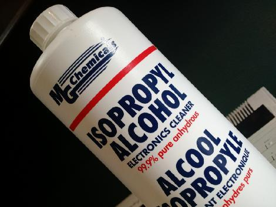

# eeZeeSwitch User Guide

The compact eeZee Switch provides flexible options for a breadboard switch that won't fall out of your breadboard.

The breakout board contains a switch with both pins broken out, a 10k optional pull-up and a debounce capacitor (optional with Rev 0.2).

# How to Assemble

Assembly is easy. And, you can learn how to solder at the same time. Review [Sparkfun's Soldering Tutorial](https://learn.sparkfun.com/tutorials/how-to-solder---through-hole-soldering) if you need to. Here's a helpful info-graphic from the tutorial:

## You'll need
* Soldering iron, 40W
* Sponge to clean the iron (I recommend a brass sponge)
* Workbench with plenty of light
* Ventilation since breathing flux fumes is irritating
* Soldering surface (e.g., marble tile sample)
* Rosin core solder 0.022” or 0.032” diameter
* Kester #2331-ZX flux pen (optional)

## Pin headers
Apply flux to the outer pin header pads on the board.

Install the pin headers into a breadboard 5 rows apart

Place eeZeeSwitch onto the pin headers with switch silkscreen on top

Solder pin headers

## Switch
If the switch isn't pre-installed, follow these instructions.

Remove eeZeeSwitch from the breadboard.

Install the switch on the side indicated by the silk screen

It may help to bend the switch tabs to hold it in place or you can place it upside down on your workbench.

Solder the switch pins in place.

Install the pin headers on the board so the switch faces up

## Cleanup

You'll want to remove the rosin and flux

I usually just use isopropyl alcohol and an old toothbrush

You can also buy chemicals specifically for removing flux and rosin

# How to Use

## Hookup (both) ##

## Active High (both), Active Low (Rev 0.2 only) ##

## Series Current Limit (Rev 0.2 only) ##

## Arduino Reset Circuit (Rev 0.2 only) ##

